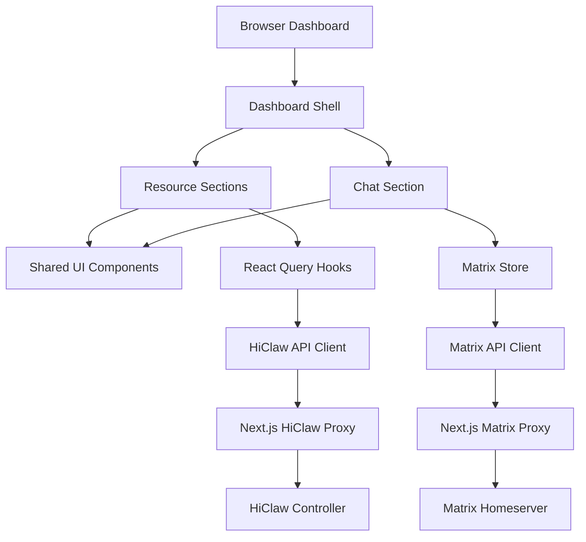
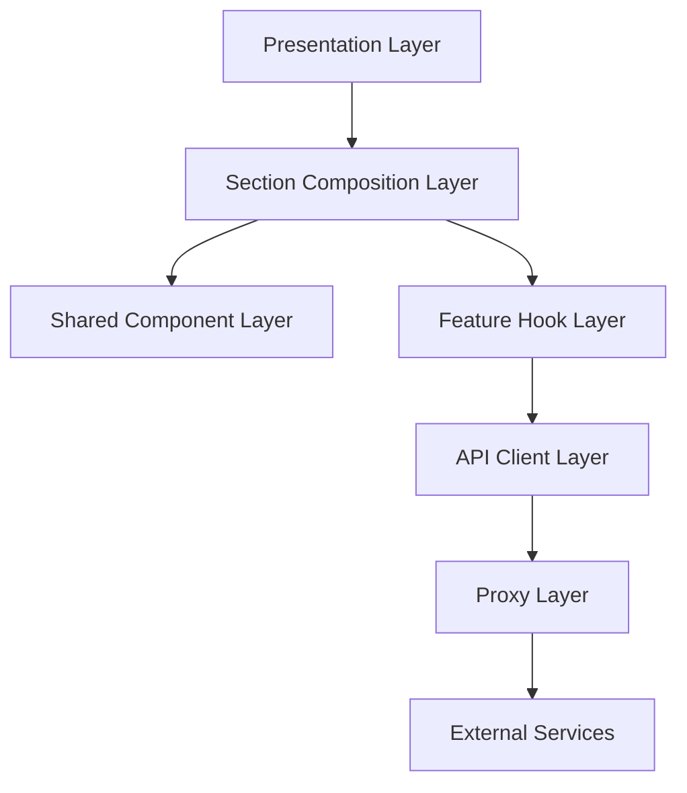

# Dashboard Refactor Governance Design

Feature Name: dashboard-refactor-governance
Updated: 2026-06-24

## Description

本设计文档定义 TaDashboard 后续重构的系统方案。目标是以安全边界、构建稳定性、可维护性、性能和测试为主线，在保持业务行为稳定的前提下继续降低代码复杂度。

项目已经完成一轮有价值的重构：顶层 dashboard shell 已拆分，`CopyButton`、`ConfirmDeleteDialog`、`PhaseBadge`、`RuntimeBadge`、`useCopyToClipboard`、`useViewMode`、`ApiError` 等共享模块已经建立。后续重构应延续现有方向，聚焦高风险路径和可验证收益。

## Refactor Decision

### Decision

继续重构。

### Rationale

- 当前代码可以运行和维护，但安全、构建、测试和性能边界仍然薄弱。
- 已完成的共享组件提取证明项目存在可系统化消除的重复模式。
- 大型 section 文件仍然承担列表、表单、对话框、业务动作和渲染逻辑多重职责。
- Matrix 代理链路处理外部输入、凭据和 HTML 内容，是最高优先级治理对象。

### Refactor Strategy

采用分阶段、小步验证策略：每阶段只处理一个风险域，每阶段结束必须通过 lint、TypeScript 检查和相关测试。

## Architecture



### Target Layering



## Components and Interfaces

### Dashboard Shell

Current files:
- `src/components/dashboard/hi-claw-dashboard.tsx`
- `src/components/dashboard/sidebar.tsx`
- `src/components/dashboard/mobile-sidebar.tsx`
- `src/components/dashboard/header.tsx`
- `src/components/dashboard/footer.tsx`
- `src/components/dashboard/nav-items.ts`
- `src/components/dashboard/use-active-section.ts`

Target responsibility:
- Own global layout and active section state.
- Avoid importing business-specific section internals.
- Keep desktop and mobile navigation behavior aligned.

### Resource Sections

Current examples:
- `workers-section.tsx`
- `teams-section.tsx`
- `humans-section.tsx`
- `managers-section.tsx`
- `k8s-section.tsx`

Target responsibility:
- Compose data hooks, action handlers and local view state.
- Delegate repeated UI to shared components.
- Split large section files into local subcomponents when sections remain above the maintainability threshold.

Recommended local split pattern:

```text
sections/workers/
├── workers-section.tsx
├── worker-card.tsx
├── worker-table.tsx
├── worker-dialogs.tsx
├── worker-actions.ts
└── worker-filters.tsx
```

### Shared UI Components

Current shared components:
- `CopyButton`
- `ConfirmDeleteDialog`
- `PhaseBadge`
- `RuntimeBadge`
- `StatusDot`
- `SectionHeader`
- `TruncatedId`
- `ApiErrorState`

Design direction:
- Shared components should be presentation-focused.
- Components should accept typed, narrow props.
- Components should avoid direct API calls and global store writes.

### Shared Hooks

Current shared hooks:
- `useCopyToClipboard`
- `useViewMode`

Target additions:
- `usePaginatedList<T>` for repeated pagination logic.
- `useSortedFilteredList<T>` for repeated search, filter and sort logic where the comparator is explicit.
- `useResourceSelection` for set-based bulk selection patterns.

### API Client Layer

Current files:
- `src/lib/hiclaw-api.ts`
- `src/lib/matrix-api.ts`
- `src/lib/api-error.ts`

Target responsibility:
- Build client requests.
- Normalize response parsing.
- Convert failures into typed errors.
- Keep credentials out of URL query strings.

### Proxy Layer

Current files:
- `src/app/api/hiclaw/proxy-helper.ts`
- `src/app/api/matrix/proxy-helper.ts`

Target responsibility:
- Validate upstream URLs.
- Enforce timeout and size limits.
- Forward only approved headers.
- Return typed JSON errors for proxy failures.

## Data Models

### Matrix Session

Current shape:

```typescript
interface MatrixState {
  homeserver: string;
  accessToken: string;
  userId: string;
  deviceId: string;
  isLoggedIn: boolean;
  syncToken: string | null;
}
```

Target shape:

```typescript
interface MatrixSessionViewState {
  homeserver: string;
  userId: string;
  deviceId: string;
  isLoggedIn: boolean;
  syncToken: string | null;
}
```

Access token should move to an HttpOnly Secure Cookie or in-memory-only client state depending on deployment constraints.

### API Error

Current shape:

```typescript
class ApiError extends Error {
  readonly status: number;
  readonly endpoint: string;
  readonly cause?: unknown;
}
```

Target additions:
- `code?: string`
- `requestId?: string`
- `retryable?: boolean`

### Resource Presentation State

Reusable state pattern:

```typescript
interface ResourceListState {
  viewMode: 'card' | 'table';
  sortKey: string;
  currentPage: number;
  selectedNames: Set<string>;
}
```

## Correctness Properties

1. A browser request to Matrix API routes must include Matrix credentials through the Authorization header or an approved server-side session mechanism.
2. A user-provided homeserver must pass upstream validation before the server sends any request to the homeserver.
3. Formatted Matrix HTML must be sanitized before rendering through `dangerouslySetInnerHTML`.
4. A shared deletion dialog must call the supplied confirm handler exactly once per confirm action.
5. Clipboard state must return to the non-copied state after the configured reset interval.
6. React Query mutation errors must use the shared error formatter for user-facing messages.
7. TypeScript validation for maintained application code must pass without filtering output.
8. Resource list pagination must preserve current page bounds when filters reduce result count.

## Error Handling

### API Client Errors

- Use `ApiError` for non-2xx responses.
- Use `NetworkError` for fetch failures.
- Use `formatErrorMessage` for UI messages.
- Preserve raw error details for logging and debugging.

### Proxy Errors

- Return status `400` for invalid user input.
- Return status `403` for disallowed upstream hosts.
- Return status `504` for upstream timeout.
- Return status `502` for upstream service failures.

### UI Errors

- Show `ApiErrorState` for failed section queries.
- Show retry actions where refetch exists.
- Show toast and notification store entries for mutation failures.
- Avoid exposing access tokens, passwords or full upstream URLs in user-visible errors.

## Security Design

### Matrix Homeserver Allowlist

Recommended policy:
- `MATRIX_HOMESERVER_ALLOWLIST` environment variable contains approved hosts.
- Development mode may allow localhost and configured preview endpoints.
- Production mode rejects private IP ranges unless explicitly configured.
- Host validation occurs after URL parsing and before outbound fetch.

### Matrix Credential Storage

Recommended design:
- Login route exchanges credentials with Matrix homeserver.
- Server stores access token in HttpOnly Secure SameSite cookie or encrypted server session.
- Browser store keeps display-only session fields.
- API client omits token parameter and relies on server-side session for proxy calls.

Transitional design:
- Continue sending Authorization header.
- Remove `accessToken` from zustand persist `partialize`.
- Keep token in memory until logout or refresh.

### HTML Sanitization

Recommended design:
- Replace regex sanitizer with `isomorphic-dompurify`.
- Allow a narrow Matrix formatting profile.
- Validate URL protocols in hooks.
- Add regression tests for XSS vectors.

## Performance Design

### Chat Virtualization

Recommended approach:
- Use a virtualized message list for `ChatPanel`.
- Keep date separators as virtual items.
- Preserve bottom-anchor autoscroll behavior.
- Load previous pages when scrolling near the top.

### Resource List Optimization

Recommended approach:
- Extract per-resource card and table row components.
- Memoize row components where props are stable.
- Extract selection and pagination hooks.
- Keep transformations in memoized selectors.

## Build and Tooling Design

### TypeScript

Recommended changes:
- Add `examples/**` to `tsconfig.exclude` if examples are documentation-only.
- Add a separate `tsconfig.examples.json` if examples should be maintained.
- Run `npx tsc --noEmit` without output filtering in CI.

### ESLint

Recovery order:
1. Enable `no-debugger`.
2. Enable `no-console` with allowed warn/error policy if needed.
3. Enable TypeScript unused variable checks.
4. Enable `react-hooks/exhaustive-deps`.
5. Revisit React Compiler rule after hook dependencies are stable.

## Test Strategy

### Unit Tests

- `useCopyToClipboard`: success, failure, reset timeout and unmount cleanup.
- `api-error`: status categories and formatting.
- `matrix-api`: URL construction, Authorization headers and error parsing.
- `sanitizeHtml`: allowed tags, blocked event handlers, blocked protocol URLs.

### Component Tests

- `ConfirmDeleteDialog`: open state, labels, disabled confirm and callback.
- `PhaseBadge`: kind-to-label mapping and fallback labels.
- `CopyButton`: accessible label and copied state.

### Integration Tests

- Matrix login flow with mocked homeserver.
- Chat send message flow.
- Worker create/update/delete mutation flow.
- Dashboard section navigation persistence.

### Build Verification

Required commands:

```bash
# Install dependencies
bun install

# Run lint checks
npm run lint

# Run TypeScript checks
npx tsc --noEmit

# Run production build
npm run build
```

## Migration Plan

### Phase 1: Stabilize Validation

- Exclude or maintain `examples/**` so TypeScript checks pass.
- Add baseline unit test framework.
- Add CI command documentation.

### Phase 2: Harden Matrix Security

- Add homeserver allowlist policy.
- Remove access token from persisted zustand state.
- Move formatted message sanitization to parser-based sanitizer.

### Phase 3: Recover Tooling Rules

- Re-enable lint rules in small batches.
- Fix reported issues per batch.
- Keep lint clean after each batch.

### Phase 4: Split Large Sections

- Split Workers section into card, table, dialogs and action hooks.
- Split Teams section with the same local component pattern.
- Split Chat section into room list, message list, composer and member panel.

### Phase 5: Improve Runtime Performance

- Add chat virtualization.
- Memoize heavy list rows.
- Measure before and after with React Profiler or browser performance tools.

## References

[^1]: (`src/app/api/matrix/proxy-helper.ts`) Matrix proxy helper and access token extraction.
[^2]: (`src/lib/matrix-store.ts`) Matrix session persistence.
[^3]: (`src/lib/utils.ts`) HTML sanitizer used before `dangerouslySetInnerHTML`.
[^4]: (`src/components/dashboard/sections/chat-section.tsx`) Chat rendering and message list logic.
[^5]: (`eslint.config.mjs`) Disabled lint rules.
[^6]: (`tsconfig.json`) TypeScript include and exclude boundaries.
